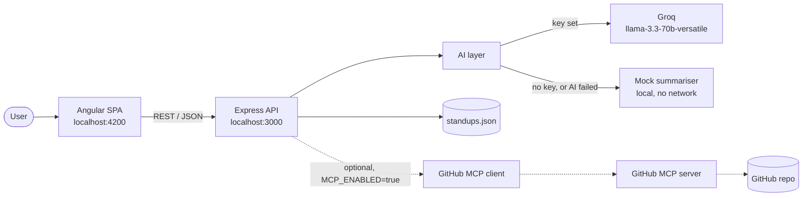
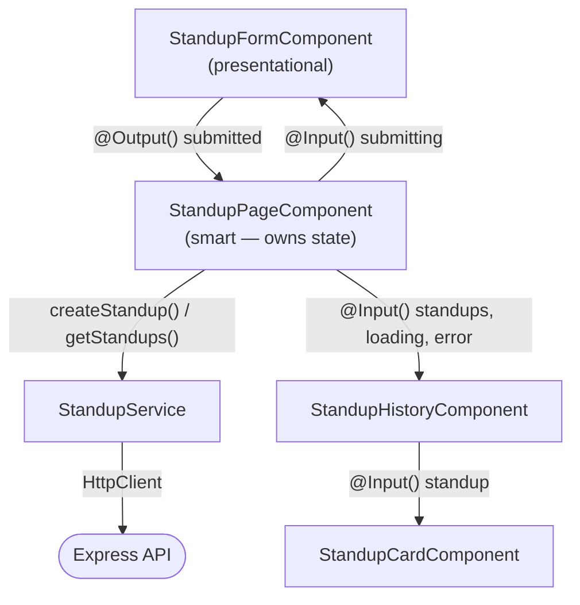
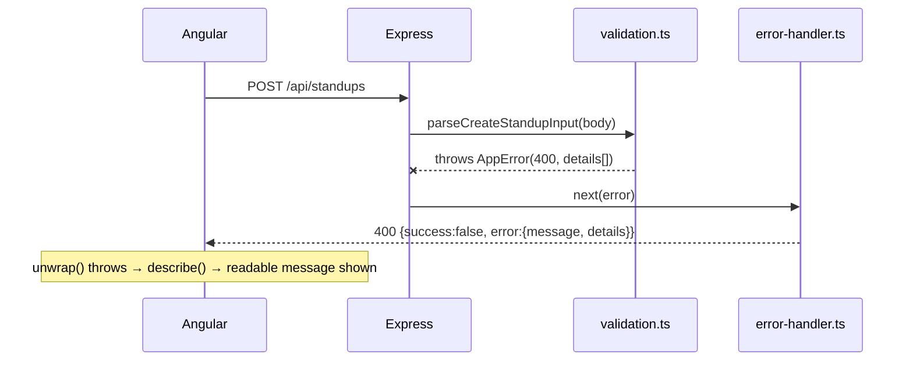
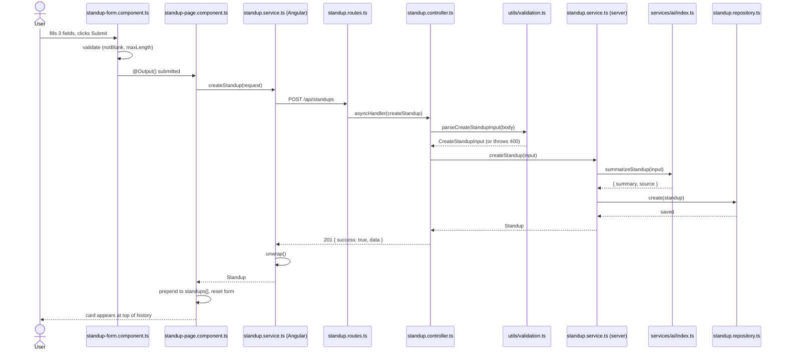
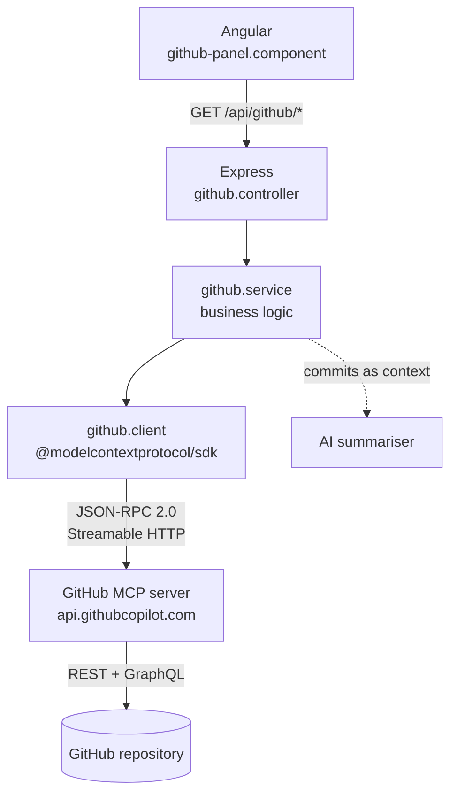

# Developer Handover — Smart Daily Standup Bot

A complete guide for a developer seeing this repository for the first time. Reading only this file should be enough to clone, run, understand, debug, and confidently explain the project.

**Companion doc:** [README.md](README.md) is the short project reference. This file is the full walkthrough. Where they overlap on setup, the README is canonical.

---

## Table of contents

1. [Project overview](#1-project-overview)
2. [Project structure](#2-project-structure)
3. [Frontend architecture](#3-frontend-architecture)
4. [Backend architecture](#4-backend-architecture)
5. [Frontend ↔ backend communication](#5-frontend--backend-communication)
6. [Complete application flow](#6-complete-application-flow)
7. [AI integration](#7-ai-integration)
8. [GitHub MCP integration (optional)](#8-github-mcp-integration-optional)
9. [Environment configuration](#9-environment-configuration)
10. [Running the project](#10-running-the-project)
11. [API documentation](#11-api-documentation)
12. [Troubleshooting](#12-troubleshooting)
13. [Future improvements](#13-future-improvements)
14. [Interview walkthrough](#14-interview-walkthrough)

---

## 1. Project overview

### Purpose

Developers write daily standups in rough, personal shorthand. Managers and Scrum Masters have to read a dozen of them. This app takes a raw three-part standup and rewrites it into a short, professional summary suitable for a team channel — while keeping the original text so nothing is lost.

Real example from the running app. Input:

```
finished the oauth token refresh, reviewed priyas PR on billing, fixed that flaky checkout test
```

Output:

> The oauth token refresh was completed, along with a review of Priya's PR on billing and a fix for the flaky checkout test.

Note that it corrected `priyas` → `Priya's` and, elsewhere in the same summary, expanded `db creds` → *database credentials* and `infra` → *infrastructure*.

### Features

- Submit a standup with three fields: **yesterday**, **today**, **blockers** (optional)
- AI rewrites it into 2–4 sentences of professional prose
- Original text, generated summary, and timestamp are all stored
- History of every past standup, newest first
- **Runs with or without an API key** — no key means a local fallback summariser
- Every summary is labelled with which engine produced it, so a fallback is never passed off as AI output
- Validation on both client and server, with all errors reported at once
- The app survives an AI outage: a failed AI call still returns a saved standup
- **Optional GitHub integration over MCP** (off by default): shows recent commits, open PRs, and open issues, and feeds recent commits to the summariser as context

### Technology stack

| Layer | Choice | Version |
|---|---|---|
| Frontend | Angular (NgModules, **not** standalone) | 19.2 |
| | TypeScript, Reactive Forms, `HttpClient`, plain SCSS | |
| Backend | Node.js + Express | Express 4.21 |
| | TypeScript (strict, `nodenext` modules) | TS 5.9 |
| AI | Groq via OpenAI-compatible API (`openai` package) | openai 7.4 |
| | Model: `llama-3.3-70b-versatile` | |
| Storage | JSON file on disk | — |
| GitHub *(optional)* | Model Context Protocol via `@modelcontextprotocol/sdk` | sdk 1.30 |

**Deliberately not used:** standalone components, NgRx, Signals, Angular Material, or any state-management library. The brief asked for regular Angular architecture, and one form plus one list does not justify more.

### High-level architecture



Dotted edges are the optional GitHub path — see [§8](#8-github-mcp-integration-optional).

Two independently installed applications. The browser never talks to Groq — **the API key stays server-side**, which is both a security property and a good interview talking point.

---

## 2. Project structure

```
AI-Smart-Standup-bot/
├── README.md          # short project reference
├── HANDOVER.md        # this file
├── .gitignore         # node_modules, dist, .env, server/data
├── server/            # Express + TypeScript API
└── client/            # Angular single-page app
```

There is no root `package.json`; each app installs and runs separately.

### Backend — `server/`

```
server/
├── package.json          # deps + scripts
├── tsconfig.json         # strict TS, nodenext modules, src/ → dist/
├── .env.example          # COMMITTED template — placeholders only
├── .env                  # your real config — git-ignored, you create it
├── data/standups.json    # datastore, created on first write, git-ignored
└── src/
    ├── server.ts                 # entry point — the only file that calls listen()
    ├── app.ts                    # builds the Express app WITHOUT listening
    ├── config/
    │   └── env.ts                # env vars → one typed config object
    ├── models/
    │   ├── standup.model.ts      # Standup, CreateStandupInput, SummarySource
    │   └── api.model.ts          # ApiResponse<T> envelope, ApiError
    ├── routes/
    │   ├── index.ts              # mounts /health and /standups under /api
    │   └── standup.routes.ts     # GET / and POST / for standups
    ├── controllers/
    │   ├── standup.controller.ts # HTTP in / HTTP out only
    │   └── health.controller.ts  # liveness + which AI provider is active
    ├── services/
    │   ├── standup.service.ts    # orchestration: summarise, then persist
    │   └── ai/
    │       ├── ai-provider.ts                 # SummaryProvider interface
    │       ├── openai-compatible-provider.ts  # the real AI call
    │       ├── mock-provider.ts               # local fallback summariser
    │       └── index.ts                       # provider choice + failure catch
    ├── mcp/                      # OPTIONAL GitHub integration — deletable
    │   ├── github.config.ts      # its own env vars, self-contained
    │   ├── github.client.ts      # MCP connection lifecycle
    │   ├── github.tools.ts       # tool names + content-block parsing
    │   └── github.service.ts     # commits / PRs / issues / status
    ├── repositories/
    │   └── standup.repository.ts # the ONLY file that touches the filesystem
    ├── middlewares/
    │   ├── error-handler.ts      # the ONLY place an error becomes a response
    │   └── not-found.ts          # unmatched routes → 404
    └── utils/
        ├── validation.ts         # request body → validated input, or throws 400
        ├── app-error.ts          # Error subclass carrying an HTTP status
        └── async-handler.ts      # routes async errors to the error middleware
```

| Folder | Why it exists | Responsibility |
|---|---|---|
| `config/` | One place reads `process.env` | Produce a typed, validated config object with working defaults |
| `models/` | Shared type vocabulary | Describe data shapes; contains no logic |
| `routes/` | Map URLs to handlers | Wiring only — no business logic |
| `controllers/` | HTTP boundary | Read request, delegate, choose a status code |
| `services/` | Business logic | Orchestrate work; know nothing about HTTP |
| `services/ai/` | Isolate the AI vendor | Hide which provider is in use behind one interface |
| `mcp/` | Isolate the optional GitHub feature | Everything MCP, including its own config — delete the folder to remove the feature |
| `repositories/` | Isolate persistence | The only filesystem access — swap here for a database |
| `middlewares/` | Cross-cutting concerns | Error formatting, 404 handling |
| `utils/` | Small shared helpers | Validation, error type, async wrapper |

**Why `app.ts` and `server.ts` are separate:** `app.ts` builds the app but does not bind a port, so tests can drive it in-process with supertest. `server.ts` is the only file that calls `listen()`.

### Frontend — `client/`

```
client/
├── package.json
├── angular.json              # build config, incl. dev/prod environment swap
└── src/
    ├── index.html            # page shell containing <app-root>
    ├── main.ts               # bootstraps AppModule
    ├── styles.scss           # design tokens (CSS variables) + resets
    ├── environments/
    │   ├── environment.ts             # production: apiBaseUrl = '/api'
    │   └── environment.development.ts # dev: http://localhost:3000/api
    └── app/
        ├── app.module.ts     # declares components, imports ReactiveFormsModule,
        │                     # provides HttpClient
        ├── app.component.*   # shell: header + <app-standup-page>
        ├── models/
        │   └── standup.model.ts    # mirrors the server contract
        ├── services/
        │   └── standup.service.ts  # the ONLY file that knows the API exists
        ├── pages/
        │   └── standup-page/       # SMART component: owns state + API calls
        └── components/
            ├── standup-form/       # reactive form; validates and emits
            ├── standup-history/    # loading / error / empty / list states
            └── standup-card/       # renders a single standup
```

| Folder | Why it exists | Responsibility |
|---|---|---|
| `models/` | Type the API contract | Mirror the server's shapes |
| `services/` | Isolate HTTP | Call the API, unwrap the envelope, produce readable errors |
| `pages/` | Smart components | Hold state, call services, coordinate children |
| `components/` | Presentational components | Render inputs, emit outputs, hold no app state |
| `environments/` | Per-build config | Supply the API base URL |

**The key structural idea:** exactly one component (`StandupPageComponent`) holds state and talks to the service. Everything in `components/` receives data through `@Input()` and reports back through `@Output()`.

---

## 3. Frontend architecture

### Module structure

A single NgModule, `AppModule` (`src/app/app.module.ts`):

```ts
@NgModule({
  declarations: [
    AppComponent, StandupPageComponent,
    StandupFormComponent, StandupHistoryComponent, StandupCardComponent,
  ],
  imports: [BrowserModule, ReactiveFormsModule],
  providers: [provideHttpClient()],
  bootstrap: [AppComponent],
})
export class AppModule {}
```

Three things worth noting:

- **All components are `standalone: false`.** Angular 19 defaults to standalone, so the app was scaffolded with `--standalone=false`. NgModules are the legacy path in modern Angular — this follows the brief, not the framework default.
- **`provideHttpClient()`, not `HttpClientModule`.** The module form is deprecated in Angular 19; the provider function works fine inside an NgModule's `providers`.
- **`ReactiveFormsModule`**, not `FormsModule` — the form is reactive, not template-driven.

### Components

| Component | Type | Responsibility |
|---|---|---|
| `AppComponent` | Shell | Header and title; renders `<app-standup-page>` |
| `StandupPageComponent` | **Smart** | Owns `standups[]`, loading/error/submitting flags, calls the service |
| `StandupFormComponent` | Presentational | Reactive form; validates and emits, never calls the API |
| `StandupHistoryComponent` | Presentational | Renders loading / error / empty / list states |
| `StandupCardComponent` | Presentational | Renders one standup |

### Services

`StandupService` (`services/standup.service.ts`), `providedIn: 'root'`:

```ts
getStandups(): Observable<Standup[]>
createStandup(request: CreateStandupRequest): Observable<Standup>
```

It is the only file that knows the API exists. It unwraps the `{success, data}` envelope so no component branches on `success`, and converts HTTP failures into a readable `Error`.

### Models

`models/standup.model.ts` mirrors the server:

```ts
type SummarySource = 'ai' | 'mock';

interface Standup {
  id: string; yesterday: string; today: string;
  blockers: string | null; summary: string;
  summarySource: SummarySource; createdAt: string;
}

interface CreateStandupRequest { yesterday: string; today: string; blockers?: string; }
type ApiResponse<T> = { success: true; data: T } | { success: false; error: ApiError };
```

These are kept in sync with `server/src/models/` **by hand** — a known limitation, see §13.

### Routing

**There is no router.** The app is a single screen: the form and the history sit side by side (stacked below 900px). Adding `RouterModule` for one view would be indirection with no benefit.

### State management

**No library, by design.** State lives as plain fields on `StandupPageComponent`:

```ts
standups: Standup[] = [];
loading = false;
submitting = false;
loadError: string | null = null;
submitError: string | null = null;
```

Data flows down through `@Input()`, events flow up through `@Output()`. NgRx would add actions, reducers, effects, and selectors to manage a single array owned by a single component. If state later needs sharing across unrelated routes, that is when to reconsider.

### Reactive Forms

Built in the constructor (not as a field initialiser, so it cannot depend on class-field evaluation order):

```ts
this.form = this.formBuilder.nonNullable.group({
  yesterday: ['', [notBlank, Validators.maxLength(2000)]],
  today:     ['', [notBlank, Validators.maxLength(2000)]],
  blockers:  ['', [Validators.maxLength(2000)]],
});
```

**`nonNullable`** means controls are typed `FormControl<string>` rather than `string | null`, so `getRawValue()` matches `CreateStandupRequest` directly.

**The custom `notBlank` validator exists for a real reason:** Angular's `Validators.required` only checks length, so `"   "` (three spaces) **passes** it — then fails server-side. `notBlank` checks the trimmed value.

On submit, an invalid form calls `markAllAsTouched()` so every error appears at once instead of one at a time.

### HttpClient usage

```ts
return this.http.get<ApiResponse<Standup[]>>(this.standupsUrl)
  .pipe(map(unwrap), catchError(toReadableError));
```

`unwrap` throws if `success === false`; `toReadableError` turns anything thrown into a friendly message — including the specific case of **status 0**, which means the request never landed, almost always a stopped API:

> "Cannot reach the API. Is the server running on http://localhost:3000?"

Subscriptions are not manually unsubscribed: `HttpClient` observables complete after one emission, so there is nothing to leak.

### Frontend data flow



---

## 4. Backend architecture

### Express application structure

`app.ts` assembles the app; the order of middleware matters:

```ts
app.use(cors({ origin: config.corsOrigin }));  // 1. allow the browser origin
app.use(express.json({ limit: '64kb' }));      // 2. parse JSON bodies
app.use('/api', apiRouter);                    // 3. the routes
app.use(notFoundHandler);                      // 4. anything unmatched → 404
app.use(errorHandler);                         // 5. every error → a response
```

Unmatched routes fall through to `notFoundHandler`, which raises a 404 `AppError`; that and every other error funnel into the single `errorHandler`.

### Layering rule

```
controller → service → (AI | repository)
```

Controllers only do HTTP. The repository only does storage. The AI layer hides the vendor. Each layer can be replaced without touching its neighbours.

### Responsibility of each major file

| File | Responsibility |
|---|---|
| `server.ts` | Calls `listen()`. The only file that binds a port |
| `app.ts` | Builds the Express app without starting it — testable in-process |
| `config/env.ts` | Reads env vars into a typed config. **Never throws** — every value has a default |
| `routes/index.ts` | Mounts `/health` and `/standups` under `/api` |
| `routes/standup.routes.ts` | `GET /` and `POST /`, each wrapped in `asyncHandler` |
| `controllers/standup.controller.ts` | Parses the body, delegates, sets `200`/`201` |
| `controllers/health.controller.ts` | Reports status, active AI provider, uptime |
| `services/standup.service.ts` | Summarise then persist; generates `id` and `createdAt` |
| `services/ai/index.ts` | Picks a provider at startup; catches **all** AI failures |
| `services/ai/openai-compatible-provider.ts` | The live AI call |
| `services/ai/mock-provider.ts` | Deterministic local summariser, no network |
| `repositories/standup.repository.ts` | JSON-file persistence; the only filesystem access |
| `middlewares/error-handler.ts` | Known errors → their message; unknown → generic `500` + log |
| `middlewares/not-found.ts` | Turns an unmatched route into a 404 `AppError` |
| `utils/validation.ts` | Untrusted body → `CreateStandupInput`, or throws `400` with all problems |
| `utils/app-error.ts` | `Error` subclass carrying an HTTP status and optional details |
| `utils/async-handler.ts` | Forwards rejected promises to the error middleware |

**Why `asyncHandler` exists:** Express 4 does **not** forward rejected promises to error middleware. Without the wrapper, an AI timeout would leave the request hanging until it timed out rather than returning a response. (Express 5 fixes this natively; this project is on 4.)

### Storage layer

`standup.repository.ts` keeps the collection in memory and writes the whole array to `server/data/standups.json` on each create.

Two details worth knowing:

- **Writes are chained**, not fired in parallel: `this.writeChain = this.writeChain.then(...)`. Two concurrent POSTs would otherwise race to rewrite the same file and could interleave.
- **A missing file is normal** (first run) and returns `[]`. Any *other* read error propagates rather than silently discarding stored data.

`findAll()` reverses a copy so callers get newest-first and cannot mutate the cache.

### Configuration

`config/env.ts` exports one frozen object, resolved at import time:

```ts
export const config: AppConfig = {
  port: readPort(process.env['PORT'], 3000),
  corsOrigin: readOptional(process.env['CORS_ORIGIN']) ?? 'http://localhost:4200',
  ai: {
    apiKey:  readOptional(process.env['AI_API_KEY']),      // null when unset
    baseUrl: readOptional(process.env['AI_BASE_URL']) ?? 'https://api.groq.com/openai/v1',
    model:   readOptional(process.env['AI_MODEL'])   ?? 'llama-3.3-70b-versatile',
  },
  dataFilePath: path.resolve(__dirname, '../../data/standups.json'),
};
```

`import 'dotenv/config'` is the **first line**, so `.env` is loaded before any `process.env` read. Config is read **once at startup** — changing `.env` requires a restart.

---

## 5. Frontend ↔ backend communication

### How Angular calls the backend

`StandupService` is the only file that makes HTTP requests. The base URL comes from the environment file, so it differs per build:

| Build | File | `apiBaseUrl` |
|---|---|---|
| `ng serve` / dev | `environment.development.ts` | `http://localhost:3000/api` |
| production | `environment.ts` | `/api` (same origin) |

The swap is configured under `fileReplacements` in `angular.json`.

### Which endpoint is called, and when

| Trigger | Service method | Request |
|---|---|---|
| Page load (`ngOnInit`) | `getStandups()` | `GET /api/standups` |
| Form submit | `createStandup(body)` | `POST /api/standups` |

`GET /api/health` is not called by the UI — it exists for humans and monitoring.

### How requests are validated

**Twice, deliberately.**

1. **Client** (`standup-form.component.ts`) — `notBlank` + `maxLength(2000)`. This is for fast feedback; it saves a round trip.
2. **Server** (`utils/validation.ts`) — the real boundary. `parseCreateStandupInput()` re-checks everything, trims, converts blank `blockers` to `null`, and throws a `400` listing **every** problem at once.

Client validation is a convenience. Any client can be bypassed with `curl`, so the server never trusts it.

### How responses are returned

Every endpoint uses one envelope:

```jsonc
{ "success": true,  "data": { /* ... */ } }
{ "success": false, "error": { "message": "...", "details": ["..."] } }
```

The client's `unwrap()` strips it, so components receive a plain `Standup` or a thrown `Error` — they never branch on `success`.

### How errors are handled



| Failure | Server behaviour | What the user sees |
|---|---|---|
| Invalid fields | `400` + `details[]` | Inline messages under each field |
| Malformed JSON | `400` "Request body is not valid JSON." | Error banner |
| Unknown route | `404` in the envelope | Error banner |
| **AI failure** | **`201`** with a mock summary | Card appears with an amber "Fallback summary" badge |
| Unexpected error | `500`, generic message, real error logged | Error banner |
| API not running | no response (status 0) | "Cannot reach the API. Is the server running…?" |

---

## 6. Complete application flow

Following one submission through every file it touches.



Step by step:

1. **User types** — `standup-form.component.html`, three `<textarea>` bound with `formControlName`.
2. **Submit clicked** — `standup-form.component.ts` → `onSubmit()`. Invalid? `markAllAsTouched()` and stop; no request is sent. Valid? emit through `@Output() submitted`.
3. **Page handles it** — `standup-page.component.ts` → `onSubmitted()`. Sets `submitting = true` (button disables, label becomes "Summarising…").
4. **Request built** — `services/standup.service.ts` → `POST` to `${environment.apiBaseUrl}/standups`.
5. **Express receives** — `app.ts` (CORS, JSON parse) → `routes/index.ts` (`/api`) → `routes/standup.routes.ts` (`POST /`), wrapped in `asyncHandler`.
6. **Controller** — `controllers/standup.controller.ts` calls `parseCreateStandupInput(req.body)`; a failure throws `AppError(400)` with every field problem.
7. **Service orchestrates** — `services/standup.service.ts` calls the AI layer first, then persists.
8. **AI layer** — `services/ai/index.ts`: key set → `openai-compatible-provider.ts` calls Groq; no key or a thrown error → `mock-provider.ts`. Returns `{ summary, source }`.
9. **Storage** — `repositories/standup.repository.ts` assigns nothing (the service supplies `randomUUID()` and ISO `createdAt`), pushes, and writes `data/standups.json` through the serialised write chain.
10. **Response** — controller returns `201 { success: true, data: standup }`.
11. **Client unwraps** — `unwrap()` returns a plain `Standup`, or converts failure into a readable `Error`.
12. **UI updates** — the page prepends the standup, calls `formComponent.reset()` via `@ViewChild`, clears `submitting`.
13. **History re-renders** — `*ngFor` with `trackById` renders one `standup-card` per entry. **No refetch** — the API returns the created record and orders newest-first, so prepending is enough.

On page load, step 13 is instead fed by `ngOnInit()` → `getStandups()` → `GET /api/standups`.

---

## 7. AI integration

### Provider and model

**Groq**, model **`llama-3.3-70b-versatile`**, via Groq's **OpenAI-compatible** chat-completions endpoint using the `openai` npm package.

### Why Groq

| Reason | Detail |
|---|---|
| Ongoing free tier | No credit card, no expiring credits — the demo still works months later |
| Volume | ~30 req/min and thousands per day, vs OpenRouter's 50/day where failed attempts also count |
| Speed | 280–1,000 tokens/sec — the summary returns in well under a second, which is visible in a live demo |
| Portability | OpenAI-compatible, so switching vendor is config, not code |
| Stability | `llama-3.3-70b-versatile` is a **production** model, not a preview one that may vanish |

### Why this model

Best instruction-following among Groq's production models for a constrained task ("2–4 sentences, no markdown, don't invent facts") — that constraint-adherence *is* the job. It also returns the summary **directly**, unlike reasoning-capable models (`gpt-oss`, Qwen3) that emit reasoning content you would have to strip.

**Licensing, stated precisely:** Llama 3.3 is **open weights** under a community licence (700M-MAU clause, attribution requirements) — *not* OSI-approved open source. If strict OSI licensing is required, `openai/gpt-oss-120b` is Apache 2.0, also production, and a one-env-var swap.

### Which file communicates with the AI

`services/ai/openai-compatible-provider.ts` — and nothing else. It is the only file that imports the `openai` package.

### How prompts are constructed

A fixed **system prompt** states an explicit output contract:

```
You rewrite raw daily standup notes into a concise, professional summary for a
manager or Scrum Master.

Output contract:
- 2 to 4 sentences of plain prose.
- Cover, in order: what was completed, what is planned next, and any blockers.
- If there are no blockers, state that briefly at the end.
- Use impersonal professional phrasing ("Completed the auth refactor", not
  "I completed the auth refactor").
- Never invent work, names, dates, ticket numbers, or progress not present in
  the notes.
- Do not editorialise, estimate completion, or add recommendations.
- No markdown, bullet points, headings, field labels, or preamble.
- Return only the summary text.
```

The **user message** is the three fields, with `None` when blockers are absent:

```
Yesterday: {yesterday}
Today: {today}
Blockers: {blockers or "None"}
```

Request parameters:

```ts
{ model, max_tokens: 300, temperature: 0, top_p: 1, seed: 42 }
```

`temperature: 0` is the determinism lever — the same standup should produce the same summary. It is near-deterministic, **not** byte-identical: server-side batching and floating-point non-associativity still introduce variance.

### How responses are parsed

```ts
const choice = completion.choices[0];
if (!choice) throw new Error('AI provider returned no choices.');
if (choice.finish_reason === 'content_filter') throw new Error('…declined…');
const text = choice.message.content?.trim();
if (!text) throw new Error('AI provider returned no text content.');
```

Three guards, each for a real failure mode:

1. **`choices[0]` guarded** — `noUncheckedIndexedAccess` is on, so TypeScript forces handling the empty case.
2. **`finish_reason` checked before reading content** — a safety refusal ends the turn with no usable text; reading it blindly would store a silently empty summary.
3. **Empty/whitespace rejected** — a blank string never reaches the datastore.

### How failures are handled

```ts
try {
  const summary = await primaryProvider.summarize(input);
  return { summary, source: primaryProvider.source };
} catch (error) {
  if (primaryProvider === mockProvider) throw error;   // mock failing is a real bug
  console.warn(`[ai] Falling back to mock summary. Reason: ${reason}`);
  return { summary: await mockProvider.summarize(input), source: mockProvider.source };
}
```

| Situation | Behaviour |
|---|---|
| No key configured | Mock is primary; `/api/health` reports `"mock"`; no network calls attempted |
| Key set, call fails (bad key, rate limit, timeout, network, refusal) | Logged server-side, mock produces the summary, request still returns **`201`** |

**The reasoning:** the user's standup is the valuable thing; the summary is an enhancement. An AI outage must never turn into a failed submission and lost input.

Every record stores `summarySource`, and the UI shows a blue **"AI summary"** or amber **"Fallback summary"** badge — a fallback is never passed off as AI output.

### How to replace the provider

| Goal | Change |
|---|---|
| Different model, same vendor | `AI_MODEL` |
| Different OpenAI-compatible vendor | `AI_API_KEY` + `AI_BASE_URL` + `AI_MODEL` |
| A provider with a different protocol | Write one class implementing `SummaryProvider`, change one line in `services/ai/index.ts` |

Groq, OpenRouter, Together, Fireworks, Cerebras, SiliconFlow, and local runtimes (Ollama, vLLM) all speak this protocol — hence the generic `openai` client rather than a vendor SDK.

---

## 8. GitHub MCP integration (optional)

**Off by default.** With `MCP_ENABLED` unset, the app behaves exactly as it does without any of this: the GitHub panel does not render, and the standup flow never calls it. You can delete `server/src/mcp/` and remove two imports and everything else still works.

### What MCP is

The **Model Context Protocol** is an open standard for connecting LLM applications to external tools and data. It is JSON-RPC 2.0 with a defined lifecycle and three roles:

- **Host** — the application (here, our Express server)
- **Client** — the protocol connector, one per server (`@modelcontextprotocol/sdk`)
- **Server** — exposes capabilities (here, GitHub's hosted MCP server)

Servers expose **tools** (callable functions), **resources** (readable data), and **prompts** (templates). We use tools only.

The problem it solves is N×M: without a standard, every AI app writes a bespoke integration for every service. With one, any client talks to any server — N+M.

### Why it is here

A standup asks "what did you do yesterday?" — and the answer is already in git. Recent commits are useful input to the summary, and useful context for whoever reads it. Secondarily, it demonstrates a current standard end to end.

**The honest trade-off, worth understanding before you defend it:** for simply displaying four lists, calling GitHub's REST API directly would be *lighter* — no SDK (~35 transitive packages), one network hop instead of two, and typed JSON instead of JSON encoded inside a text block. MCP earns its place through uniform access to ~40 tools without per-endpoint wrappers, schema discovery via `tools/list`, and the fact that swapping GitHub for GitLab or Jira is a config change. It is the right foundation once the LLM starts *choosing* what to fetch rather than being handed fixed data.

### Architecture



Plain text version:

```
Angular  →  Node.js API  →  GitHub MCP client  →  GitHub MCP server  →  GitHub repository
```

### The files

```
server/src/mcp/
├── github.config.ts    # its own env vars — self-contained on purpose
├── github.client.ts    # connection lifecycle: connect, listTools, callTool
├── github.tools.ts     # tool names + content-block parsing + mapping
└── github.service.ts   # getCommits / getPullRequests / getIssues / getStatus
```

| File | Responsibility |
|---|---|
| `github.config.ts` | Reads `MCP_ENABLED`, `GITHUB_*`. Keeps GitHub settings out of `config/env.ts` so the feature is deletable in one folder |
| `github.client.ts` | Owns the MCP session. Connects **lazily** on first use so a broken config cannot delay or break server boot |
| `github.tools.ts` | Tool-name constants, unwraps MCP content blocks, maps raw GitHub payloads to small typed models |
| `github.service.ts` | Business logic and the `owner`/`repo` lock. `getCommitsForContext()` never throws |

### How the backend communicates with it

1. **`initialize`** — protocol and capability handshake, with the PAT sent as `Authorization: Bearer`
2. **`tools/list`** — on connect, so we know what the server offers (this is the part REST has no equivalent for). The count is reported by `/api/github/status`
3. **`tools/call`** — `{ name: "list_commits", arguments: { owner, repo, sha, perPage, fields } }`
4. **Result** — arrives as `{ content: [{ type: "text", text: "<json>" }] }`; `parseToolResult()` unwraps and parses it

The connection is a **lazy singleton**: the handshake is per-session, so opening one per HTTP request would add a round trip to every call. Concurrent first-requests share one in-flight connect. A failed call drops the session so the next request reconnects rather than reusing a dead one.

**Two tool-parameter traps** found by inspecting the live schemas rather than guessing:

- `list_pull_requests` takes `state: 'open'` (lowercase) but `list_issues` takes `state: 'OPEN'` (uppercase) — the latter is GraphQL-backed
- `search_repositories` defaults to `minimal_output: true`, which strips the fields the repository view needs

### How to start the MCP server

**You don't.** `GITHUB_MCP_URL` defaults to GitHub's hosted server, so a token is the only prerequisite — nothing to install or run.

To use a local server instead, run the official image and repoint the URL. No code changes:

```bash
docker run -i --rm -e GITHUB_PERSONAL_ACCESS_TOKEN=<token> ghcr.io/github/github-mcp-server
```

### How to verify it works

```bash
curl http://localhost:3000/api/github/status
```

```json
{"success":true,"data":{"enabled":true,"configured":true,"connected":true,
 "owner":"you","repo":"your-repo","toolCount":42,"message":"Connected. 42 tools available."}}
```

The three booleans are deliberately separate so a failure tells you *which* step broke:

| `enabled` | `configured` | `connected` | Meaning |
|---|---|---|---|
| `false` | — | — | `MCP_ENABLED` is not `true` |
| `true` | `false` | `false` | Missing `GITHUB_TOKEN` / `GITHUB_OWNER` / `GITHUB_REPO` — `message` names them |
| `true` | `true` | `false` | Handshake failed — `message` carries the reason (bad token, network, wrong URL) |
| `true` | `true` | `true` | Working. `toolCount` proves discovery succeeded |

Then check the data routes and the UI panel:

```bash
curl "http://localhost:3000/api/github/commits?limit=3"
```

### AI enhancement

When the integration is on, up to **5 recent commit subjects** are passed to the summariser as extra context, so the summary can reference concrete work.

`StandupService.buildGithubContext()` is the single point where the standup flow touches MCP. It calls `getCommitsForContext()`, which **never throws** — it returns `[]` when GitHub is disabled, unconfigured, or unreachable. No commits means no context, which is exactly the pre-MCP behaviour.

**Security: commit messages are untrusted input.** Anyone with push access writes them, and they end up inside an AI prompt. Three mitigations:

1. They are fenced in a `<recent_commits>` block
2. **Angle brackets are stripped from the content** — otherwise a commit message containing `</recent_commits>` could close the fence early and have the rest read as top-level instructions
3. The system prompt instructs the model to treat the block as read-only reference data and never follow instructions inside it

Blast radius is low here (the model produces text and has no tools), but the pattern is what matters — the same mistake in an agent with tool access is serious.

---

## 9. Environment configuration

`server/.env.example` is the **committed template**. `server/.env` holds real values and is **git-ignored**. Create it with:

```bash
cd server
cp .env.example .env      # PowerShell: Copy-Item .env.example .env
```

> ⚠️ **Put real keys in `.env`, never in `.env.example`.** The filenames differ by one word and only `.env` is ignored — a key placed in the template gets published.

| Variable | Required | Example (placeholder) | Purpose | Used by |
|---|---|---|---|---|
| `PORT` | No — defaults `3000` | `3000` | Port the API listens on | `config/env.ts` → `server.ts` |
| `CORS_ORIGIN` | No — defaults `http://localhost:4200` | `http://localhost:4200` | Browser origin allowed to call the API | `config/env.ts` → `app.ts` |
| `AI_API_KEY` | **No** | `your_api_key_here` | Enables the live provider. Absent → mock | `config/env.ts` → `services/ai/index.ts` |
| `AI_BASE_URL` | No — defaults Groq | `https://api.groq.com/openai/v1` | Any OpenAI-compatible endpoint | `config/env.ts` → `openai-compatible-provider.ts` |
| `AI_MODEL` | No — defaults Llama 3.3 | `llama-3.3-70b-versatile` | Model ID for that vendor | `config/env.ts` → `openai-compatible-provider.ts` |
| `MCP_ENABLED` | No — defaults `false` | `false` | Master switch for the GitHub integration | `mcp/github.config.ts` |
| `GITHUB_TOKEN` | Only if enabled | `your_github_token_here` | GitHub PAT, read-only scope | `mcp/github.config.ts` → `github.client.ts` |
| `GITHUB_OWNER` | Only if enabled | `your_github_username` | Repo owner. Never taken from the client | `mcp/github.service.ts` |
| `GITHUB_REPO` | Only if enabled | `your_repository_name` | Repo name. Never taken from the client | `mcp/github.service.ts` |
| `GITHUB_BRANCH` | No | *(blank)* | Branch for commits; blank means the default | `mcp/github.service.ts` |
| `GITHUB_MCP_URL` | No — defaults GitHub's | `https://api.githubcopilot.com/mcp/` | MCP endpoint; repoint for a local server | `mcp/github.client.ts` |

**Every variable is optional.** With no `.env` at all the server boots on port 3000 using the mock summariser — a new developer can clone and run with zero configuration.

Formatting rules: no quotes around values, no spaces around `=`, and **restart the server** after any change (config is read once at startup).

### Getting a free API key

1. Sign up at <https://console.groq.com> — no credit card
2. **API Keys** → **Create API Key**
3. Copy immediately; the console shows it only once
4. Keys look like `gsk_...`
5. Paste into `server/.env` as `AI_API_KEY=gsk_...` and restart

Verify: `curl http://localhost:3000/api/health` → `"aiProvider":"ai"`.

### Keeping keys out of Git

- `.env` is ignored at both the root and in `server/.gitignore`. Check with `git status` — it should never appear.
- Commit `.env.example` (placeholders only), never `.env`.
- **The key never reaches the browser.** It is read server-side and used only in `openai-compatible-provider.ts`; it appears in no API response and no frontend bundle.
- If a key is ever committed, **revoke it in the provider console** and issue a new one. Deleting the line is not enough — the value stays in Git history, which is what scrapers read. Check with:

  ```bash
  git log -p --all -- server/.env.example | grep -c "gsk_"
  ```

---

## 10. Running the project

### Prerequisites

| Tool | Version | Notes |
|---|---|---|
| Node.js | 20+ (developed on **22.14.0**) | `node --version` |
| npm | 10+ (developed on **10.9.2**) | Ships with Node |
| Angular CLI | 19.2.5 | **No global install needed** — local devDependency |
| Git | any recent | To clone |

You do **not** need a database, Docker, or an API key to run the project.

### Install

```bash
git clone https://github.com/your-org/AI-Smart-Standup-bot.git
cd AI-Smart-Standup-bot
```

Two separate installs — there is no root-level install:

```bash
cd server && npm install
cd ../client && npm install
```

The frontend install is slower (Angular pulls a large toolchain).

### Start the backend

```bash
cd server
npm run dev
```

Expected:

```
[server] Listening on http://localhost:3000
[server] AI provider: mock
[server] Allowed origin: http://localhost:4200
```

`npm run dev` runs `tsx watch`, which restarts on file changes.

### Start the frontend

In a **second terminal**:

```bash
cd client
npm start
```

Wait for `Application bundle generation complete`, then open <http://localhost:4200>.

There is no combined runner — two terminals are required.

### Verify the backend

```bash
curl http://localhost:3000/api/health
```

```json
{"success":true,"data":{"status":"ok","aiProvider":"mock","uptimeSeconds":12}}
```

Then a full round trip:

```bash
curl -X POST http://localhost:3000/api/standups \
  -H "Content-Type: application/json" \
  -d '{"yesterday":"Shipped the login flow","today":"Wire up the payments webhook"}'
```

Expect `201` with a generated `id`, `summary`, `summarySource`, and `"blockers":null`.

And that validation rejects bad input:

```bash
curl -X POST http://localhost:3000/api/standups -H "Content-Type: application/json" -d '{}'
```

Expect `400` naming **both** missing fields.

### Verify the frontend

Open <http://localhost:4200>:

- History shows **"No standups yet"** → the frontend reached the API and it is empty
- History shows **"Cannot reach the API…"** → the backend is not running, or ports mismatch

Submit a standup: the button reads "Summarising…", a card appears at the top with a timestamp and badge, and the form clears. Reload — the card is still there.

### Other commands

```bash
# server
npm run typecheck   # TypeScript check, no output
npm run build       # compile to dist/
npm start           # run the compiled build (needs build first)

# client
npm run build       # production bundle into dist/
```

`npm test` in `client/` does nothing useful — this project has no test specs (see §13).

### Ports

| Service | Port | Set by |
|---|---|---|
| API | `3000` | `PORT` in `server/.env` |
| Frontend | `4200` | Angular CLI default |

**Changing the API port** needs two changes, or the frontend calls the wrong address:

1. `server/.env` → `PORT=3005`
2. `client/src/environments/environment.development.ts` → `apiBaseUrl: 'http://localhost:3005/api'`

**Changing the frontend port** also needs two, or CORS blocks the browser:

1. `npm start -- --port 4300`
2. `server/.env` → `CORS_ORIGIN=http://localhost:4300`

Restart the server after any `.env` change.

---

## 11. API documentation

Base URL: `http://localhost:3000/api`. Every response uses the same envelope.

### `GET /api/health`

Liveness check, and the fastest way to see which AI provider is active.

**Request body:** none

```bash
curl http://localhost:3000/api/health
```

**`200 OK`**

```json
{ "success": true, "data": { "status": "ok", "aiProvider": "mock", "uptimeSeconds": 42 } }
```

`aiProvider` is `"ai"` when a key was found, `"mock"` otherwise.

---

### `GET /api/standups`

All standups, newest first. Called once on page load.

**Request body:** none

```bash
curl http://localhost:3000/api/standups
```

**`200 OK`**

```json
{
  "success": true,
  "data": [
    {
      "id": "f8a26fc0-53b7-4690-9143-f748c59dfb54",
      "yesterday": "finished the oauth token refresh",
      "today": "start webhook retry logic",
      "blockers": "waiting on staging db creds",
      "summary": "The oauth token refresh was completed. Next, work will begin on the webhook retry logic. The team is still waiting on staging database credentials, which is currently a blocker.",
      "summarySource": "ai",
      "createdAt": "2026-08-04T11:27:42.163Z"
    }
  ]
}
```

Empty datastore returns `{"success":true,"data":[]}`.

---

### `POST /api/standups`

Validates, generates a summary, stores, and returns the stored record.

**Request body**

| Field | Type | Required | Rules |
|---|---|---|---|
| `yesterday` | string | Yes | Non-blank after trimming, ≤ 2000 chars |
| `today` | string | Yes | Non-blank after trimming, ≤ 2000 chars |
| `blockers` | string | No | ≤ 2000 chars; omitted or blank stored as `null` |

All values are trimmed before storage.

```bash
curl -X POST http://localhost:3000/api/standups \
  -H "Content-Type: application/json" \
  -d '{
    "yesterday": "Finished the OAuth refresh work",
    "today": "Start on webhook retry logic",
    "blockers": "Waiting on staging DB credentials"
  }'
```

**`201 Created`**

```json
{
  "success": true,
  "data": {
    "id": "8ed2fa11-2491-4c0d-8f17-3e5ef9e33dc3",
    "yesterday": "Finished the OAuth refresh work",
    "today": "Start on webhook retry logic",
    "blockers": "Waiting on staging DB credentials",
    "summary": "The OAuth refresh work was completed. Next, work will begin on the webhook retry logic. Staging database credentials are still outstanding, which is currently a blocker.",
    "summarySource": "ai",
    "createdAt": "2026-08-04T07:12:54.451Z"
  }
}
```

**`400 Bad Request`** — every problem at once, not one per attempt:

```json
{
  "success": false,
  "error": {
    "message": "Validation failed.",
    "details": [
      "\"yesterday\" is required and must be a non-empty string.",
      "\"today\" is required and must be a non-empty string."
    ]
  }
}
```

Malformed JSON returns `400` with `"Request body is not valid JSON."`

---

---

### `GET /api/github/*` (optional)

These routes always exist. When `MCP_ENABLED` is not `true` they report that rather than 404, which is easier to diagnose than a missing route.

| Route | Purpose |
|---|---|
| `/api/github/status` | Integration state — **always `200`** |
| `/api/github/commits` | Latest commits |
| `/api/github/pull-requests` | Open pull requests |
| `/api/github/issues` | Open issues |
| `/api/github/repository` | Repository metadata |

The four data routes accept `?limit=` (default 10, max 50, clamped rather than rejected). `limit` is the only caller-supplied input — `owner` and `repo` come from configuration.

```bash
curl "http://localhost:3000/api/github/commits?limit=3"
```

**`200 OK`**

```json
{
  "success": true,
  "data": [
    {
      "sha": "a1b2c3d4e5f6...",
      "shortSha": "a1b2c3d",
      "message": "Fix login redirect loop",
      "author": "octocat",
      "url": "https://github.com/owner/repo/commit/a1b2c3d4e5f6",
      "committedAt": "2026-08-04T09:12:00Z"
    }
  ]
}
```

**Error responses**

| Code | When |
|---|---|
| `503` | Integration disabled or missing configuration — message names what is missing |
| `502` | The MCP call itself failed (bad token, rate limit, network, server down) |

`/status` never returns either: reporting "disabled" is its success case, and the UI calls it first so users never meet these errors.

---

### Status codes

| Code | Meaning |
|---|---|
| `200` | Successful `GET` |
| `201` | Standup created |
| `400` | Validation failure or malformed JSON |
| `404` | Unknown route |
| `500` | Unexpected error — logged in full server-side, generic message returned |
| `502` | GitHub MCP upstream failed |
| `503` | GitHub integration disabled or unconfigured |

**An AI failure does not produce an error status.** It returns `201` with `summarySource: "mock"`.

---

## 12. Troubleshooting

### Missing `.env`

**Not an error.** The app runs without one, using the mock summariser. If you expected real AI summaries and got mock ones, `curl http://localhost:3000/api/health` confirms which provider is active.

### Invalid API key

**Symptom:** cards keep showing the amber "Fallback summary" badge despite a key being set.

**Diagnose:** read the server terminal.

```
[ai] Falling back to mock summary. Reason: AI request failed: 401 — 401 Invalid API Key
```

A `401` means the key is wrong. If `/api/health` reports `"aiProvider":"mock"`, the key was not read at all — likely a typo in the variable name, quotes around the value, the key placed in `.env.example` instead of `.env`, or the server was not restarted.

**Fix:** correct the key in `server/.env` (exactly `AI_API_KEY=gsk_...`, no quotes or spaces) and restart. If genuinely rejected, generate a new key at <https://console.groq.com/keys>.

A **`429`** instead means the free-tier rate limit was hit — wait a minute and retry.

### Port already in use

**Symptom:** `Error: listen EADDRINUSE: address already in use :::3000`

**The most common cause is a previous dev server still running** — often an orphan. `tsx watch` spawns a child process, so closing a terminal can leave the child holding the port, and it can even respawn on file changes.

Find and kill every project Node process (PowerShell):

```powershell
Get-CimInstance Win32_Process -Filter "Name = 'node.exe'" |
  Where-Object { $_.CommandLine -like "*AI-Smart-Standup-bot*" } |
  ForEach-Object { Stop-Process -Id $_.ProcessId -Force }
```

Or just the port owner:

```powershell
Get-NetTCPConnection -LocalPort 3000 -State Listen |
  Select-Object -ExpandProperty OwningProcess | ForEach-Object { Stop-Process -Id $_ -Force }
```

macOS / Linux:

```bash
lsof -i :3000
kill -9 <PID>
```

> **A trap worth knowing:** if a stale server is holding the port, your *new* server fails to start but `curl` still returns `200` — from the **old** process. A suspiciously high `uptimeSeconds` in `/api/health` is the giveaway. Always confirm you are testing the process you think you are.

### CORS errors

**Symptom:** browser console shows `blocked by CORS policy`, and the UI shows "Cannot reach the API".

**Cause:** the origin serving the frontend does not match `CORS_ORIGIN`. Almost always a non-default frontend port.

**Fix:** set `CORS_ORIGIN` in `server/.env` to the exact origin from the error — scheme, host, port, no trailing slash — and restart.

```ini
CORS_ORIGIN=http://localhost:4300
```

### Build failures

| Symptom | Fix |
|---|---|
| `EBADENGINE` during install | Node too old — needs 20+ |
| `Cannot find module '@angular/...'` | Install incomplete; re-run `npm install` in `client/` |
| Stale Angular behaviour after dep changes | Delete `client/.angular/` and rebuild |
| `Cannot find module 'openai'` when running `dist/` | `dist/` is stale — re-run `npm run build` |
| Template type errors | Angular typechecks templates; the error names file and line |
| Corrupt install | `rm -rf node_modules package-lock.json && npm cache clean --force && npm install` |

**A stale `dist/` is a real trap:** `npm run build` output is not cleaned automatically, so files from deleted source can linger and get executed by `npm start`. If behaviour does not match the source, delete `dist/` and rebuild.

### AI provider failures

By design these **never break the request** — you get a `201` with a fallback summary. Diagnose from the server log:

| Log reason | Meaning | Fix |
|---|---|---|
| `401 Invalid API Key` | Bad or revoked key | Regenerate in the Groq console |
| `429 …` | Rate limit hit | Wait, or switch to `llama-3.1-8b-instant` (higher limits) |
| `connection error` | No network, or wrong `AI_BASE_URL` | Check connectivity and the URL |
| `AI provider returned no choices` | Model returned nothing | Try another `AI_MODEL` |
| `…declined…` | Content filter | Rephrase the standup |

If summaries are mock but you expected AI, check `/api/health` **first** — it distinguishes "no key found" from "key found but calls failing".

### GitHub MCP failures

**Always start with `/api/github/status`** — its three booleans localise the fault before you guess.

| Symptom | Diagnosis | Fix |
|---|---|---|
| Panel does not appear at all | `enabled: false` | `MCP_ENABLED=true` in `server/.env`, restart |
| `configured: false` | `message` names the missing variables | Set `GITHUB_TOKEN` / `GITHUB_OWNER` / `GITHUB_REPO` |
| `connected: false`, message mentions `401` | Bad or expired token | Regenerate at <https://github.com/settings/tokens> |
| `connected: false`, message mentions `404` | Repo not found, or token lacks access | Check owner/repo spelling; a private repo needs `repo` scope, not `public_repo` |
| `connected: false`, timeout | MCP server unreachable | Check network and `GITHUB_MCP_URL` |
| Panel shows, lists are empty | Connected but the repo genuinely has none | Confirm against github.com |
| `502` from a data route | The MCP call failed after connecting | Reason is in the server log; commonly a rate limit (`403`/`429`) |

**None of these affect the standup flow.** GitHub failures are logged with `[github]` or surfaced in the panel; submitting a standup keeps working, just without commit context.

**Rate limits:** GitHub allows 5,000 authenticated REST requests/hour. The panel makes three calls per page load, so this only bites under heavy refreshing. There is no caching layer — see §13.

### Changes to `.env` have no effect

Config is read once at startup. Restart the server.

---

## 13. Future improvements

Intentionally out of scope for an interview project, listed roughly by value:

| Improvement | Why, and where it would go |
|---|---|
| **Unit & integration tests** | The highest-value gap. Seams already exist: `StandupService` takes an injected repository, `app.ts` builds without `listen()`, `SummaryProvider` is trivially stubbed. Start with `parseCreateStandupInput`, the AI fallback, and a supertest run against `createApp()` |
| **A real database** | `standup.repository.ts` is the only file touching storage — swap it for SQLite or Postgres and nothing above changes |
| **Authentication & multiple users** | Add an owner to `Standup`, scope queries, protect routes with middleware |
| **Shared types package** | `client/src/app/models` and `server/src/models` are kept in sync by hand today |
| **Pagination** | `GET /api/standups` returns everything; add `limit`/`cursor` once history grows |
| **Search & filtering** | By date range, by text, by blockers-present |
| **Atomic writes** | Concurrent writes are serialised, but a crash mid-write could truncate the file; write to a temp file and rename |
| **Rate limiting** | `POST /api/standups` costs an AI request — `express-rate-limit` per IP |
| **Caching GitHub responses** | The panel makes three MCP calls per page load. A 60-second TTL cache in `mcp/github.service.ts` would cut that to near zero under refreshing and protect the GitHub rate limit |
| **Let the LLM choose MCP tools** | Today the backend calls fixed tools. Passing the `tools/list` schemas to the model and letting it decide what to fetch is where MCP genuinely beats REST — and the client already discovers them |
| **Docker** | A `docker-compose.yml` running both apps would remove the two-terminal setup |
| **CI/CD** | GitHub Actions running typecheck, build, and tests on PRs |
| **Deployment** | API to Render/Fly/Railway, client to Netlify/Vercel; set `CORS_ORIGIN` to the deployed frontend |
| **Structured outputs** | Have the model return a typed object rather than prose |
| **Streaming** | Stream the summary token-by-token for perceived speed |
| **Accessibility audit** | Basics are handled (labels, `aria-invalid`, focus styles); a full audit would go further |

---

## 14. Interview walkthrough

### Opening — show it working first (60 seconds)

Have both servers running and the browser open **before** you start talking.

1. **Submit a standup.** Type deliberately sloppy input — lowercase, abbreviations like "db creds", a name like "priyas". Watch the summary clean it up. Working software earns attention that a code tour does not.
2. **Point at the badge.** "Blue means the AI wrote it; amber means the local fallback did. The app never presents a fallback as AI output."
3. **Show `/api/health`.** One endpoint answering "is it up, and which provider is live".

### The demo that wins it

Stop the server, put a deliberately invalid key in `.env`, restart, and submit.

It still returns `201`, the card still appears, the badge reads "Fallback summary", and the server log shows the real `401`.

Then say: *"The user's standup is the valuable thing; the summary is an enhancement. An AI outage should never cost someone their input."*

That one demo proves you designed for failure before anyone asked.

### Architecture in one sentence

> "Layered, with one rule: controller → service → AI or repository. Controllers only do HTTP, the repository only does storage, and the AI layer hides which provider is in use — so each layer can be replaced without touching the others."

### Files to walk through, in order

1. **`services/ai/index.ts`** — the whole design in 20 lines. One seam satisfying two requirements: "mock if no key" and "handle AI failures gracefully" are the same problem.
2. **`services/ai/ai-provider.ts`** — a one-method interface. Name the Strategy pattern here.
3. **`services/ai/openai-compatible-provider.ts`** — `temperature: 0` for determinism, the `finish_reason` and `choices[0]` guards, and the configurable base URL that makes the vendor swappable.
4. **`repositories/standup.repository.ts`** — the only file touching the filesystem, so a database swap is one class.
5. **`middlewares/error-handler.ts`** — one place an error becomes a response; known errors surface their message, unknown ones become a generic `500` and are logged.
6. **`pages/standup-page/standup-page.component.ts`** — one smart component owning state, everything else presentational.

### Backend explanation

Express 4 with a strict layering rule. Two details that show depth:

- **`asyncHandler`** — Express 4 does not forward rejected promises to error middleware. Without it, an AI timeout leaves the request hanging instead of returning a response.
- **`app.ts` separate from `server.ts`** — the app builds without binding a port, so it is testable in-process.

### Frontend explanation

One NgModule, one smart component, three presentational ones. State is plain fields; data flows down via `@Input()`, events up via `@Output()`.

The detail worth volunteering: **`Validators.required` passes on `"   "`** because it only checks length. A small `notBlank` validator checks the trimmed value, so whitespace-only input is caught client-side instead of bouncing off the server.

### Design decisions to raise unprompted

- **Strategy pattern for the AI provider** — one interface, two implementations, one fallback seam.
- **The generic `openai` client rather than a Groq SDK** — Groq, OpenRouter, Together, and local Ollama all speak the same protocol, so switching vendor is three env values and no code.
- **`summarySource` on the model** — the one field added beyond the brief, so a fallback is never passed off as AI output.
- **Validation on both sides** — client for UX, server because any client can be bypassed.
- **Serialised writes** — two concurrent submissions cannot interleave writes to the JSON file.
- **The API key never reaches the browser** — all AI calls are server-side. Worth saying out loud; many candidates miss it.

### Trade-offs to name honestly

| Chose | Over | Because |
|---|---|---|
| JSON file | A database | Zero setup for a reviewer; the repository isolates the swap |
| No state library | NgRx | One array owned by one component |
| NgModules | Standalone components | The brief required it — though standalone is Angular's default now |
| Llama 3.3 70B | An Apache-2.0 model | Best instruction-following; the licence caveat is real and worth stating |
| Fallback to mock | Failing loudly on AI errors | Never lose a user's input |

### Limitations to acknowledge

Volunteering these reads as senior; being caught out by them does not.

- **No tests.** The brief did not ask, and shipping Angular's auto-generated specs would have meant a repo where `ng test` fails. The seams for testing are deliberately in place.
- **JSON file storage** does not suit multiple instances or high write volume.
- **Types duplicated** between client and server, synced by hand.
- **No auth, pagination, or rate limiting.**
- **Llama 3.3 is open *weights*, not OSI open source** — be precise about this rather than calling everything "open source".

### Likely questions, with short answers

**Why no NgRx or a state library?**
One form and one list. State lives in a single component and flows down through inputs. NgRx would add actions, reducers, and effects to manage one array. I would reach for it when state is shared across unrelated routes or needs time-travel debugging.

**Angular defaults to standalone components — why NgModules?**
The brief required it. Worth knowing NgModules are the legacy path now, so I scaffolded explicitly with `--standalone=false` rather than fighting the generator.

**What happens if the AI provider goes down?**
*(Demo it.)* The call is wrapped, the failure logged, the mock produces the summary, and the request still returns `201`. The stored record marks it as a fallback.

**Why the `openai` package instead of a Groq SDK?**
Groq, OpenRouter, Together, Fireworks, and local Ollama all speak the OpenAI chat-completions protocol. A generic client with a configurable base URL means changing vendor is three env values and no code. A vendor SDK would have locked us in for no benefit.

**Why Groq over OpenRouter?**
OpenRouter's free tier is 50 requests/day and failed attempts count against it — you would exhaust it while tuning a prompt. Groq's is ongoing, needs no card, allows thousands per day, and is much faster.

**Is `llama-3.3-70b-versatile` really open source?**
It is **open weights**, not OSI-approved — the Llama Community Licence carries a 700M-MAU clause and attribution requirements. If strict OSI licensing matters, `openai/gpt-oss-120b` is Apache 2.0 and a one-env-var swap.

**Why `temperature: 0`?**
The same standup should produce the same summary; a summariser that reworded itself every call would look broken. It is near-deterministic rather than byte-identical, because batching and floating-point non-associativity still introduce variance.

**Why check `finish_reason` before reading the response?**
A safety refusal arrives as a normal `200` with no usable content. Reading `message.content` blindly would store a silently empty summary.

**How would you swap the JSON file for a database?**
Replace `standup.repository.ts`. It is the only module touching storage, and the service depends on the class rather than the file, so nothing above it changes.

**How would you test this?**
Three highest-value tests: `parseCreateStandupInput` for validation rules, `summarizeStandup` with a throwing stub provider to prove the fallback, and a supertest run against `createApp()` for the `POST` contract. The seams are already there.

**Why validate on both client and server?**
Client-side for fast feedback; server-side because any client can be bypassed with `curl`. The server is the only real boundary.

**Is the API key exposed to the frontend?**
No. It is read server-side in `config/env.ts` and used only in `openai-compatible-provider.ts`. It never appears in a response or in the client bundle.

**What about two people submitting at once?**
Writes are chained through a promise so they cannot interleave. A crash mid-write could still truncate the file — the next step would be writing to a temp file and renaming, which is atomic.

**What would you do differently with more time?**
Tests first, then a shared types package so the two contracts cannot drift, then a real database.

### MCP questions

**What is MCP, in one sentence?**
An open standard — JSON-RPC 2.0 with a defined lifecycle — that lets an application connect to tool servers through one protocol, so any client can talk to any server instead of every app writing a bespoke integration per service.

**Why MCP instead of just calling the GitHub REST API?**
*(Answer this honestly — it is the obvious challenge and a canned answer sounds rehearsed.)* For the four lists we display, REST would genuinely be lighter: no SDK, one hop instead of two, and typed JSON instead of JSON encoded inside a text block. MCP earns its place three ways — one client covers ~40 tools with no per-endpoint wrapper, `tools/list` returns schemas you can hand straight to a model, and swapping GitHub for GitLab is config rather than code. It is the right foundation once the LLM chooses what to fetch. Knowing when a technology is *not* warranted matters as much as knowing how to use it.

**How does your backend talk to the MCP server?**
JSON-RPC over Streamable HTTP. `initialize` handshake with the PAT as a bearer token, then `tools/list` to discover capabilities, then `tools/call`. The connection is a lazy singleton because the handshake is per-session — one per request would add a round trip to every call.

**What happens if the MCP server is down?**
`/api/github/status` reports `connected: false` with the reason and the panel shows it instead of data. Data routes return `502`. The standup flow is untouched — `getCommitsForContext()` returns an empty array on any failure, so the summary is generated from the notes alone.

**Where is the security risk in feeding commits to an LLM?**
Prompt injection. Anyone with push access writes commit messages, and they land inside a prompt. Three mitigations: the commits are fenced in a `<recent_commits>` block, angle brackets are stripped so a message cannot close the fence early and escape, and the system prompt tells the model to treat the block as data. Low blast radius here since the model only writes text — but the same mistake in an agent with tool access is serious.

**Why is `owner`/`repo` not a query parameter?**
That would turn the API into an authenticated proxy that fetches any repository my token can reach, for anyone who can call the endpoint. They come from configuration; `limit` is the only caller-supplied input, and it is clamped.

**What did you learn building it?**
That tool schemas are worth reading rather than assuming. `list_pull_requests` takes `state: 'open'` but `list_issues` takes `state: 'OPEN'` because it is GraphQL-backed, and `search_repositories` defaults to `minimal_output: true`, which silently strips fields. I checked the live schemas instead of guessing and avoided three bugs.

### If something breaks live

Check in order: is the backend terminal still running; does `/api/health` respond; does the browser console show a CORS error (ports out of sync). §12 covers each. **Narrate your diagnosis rather than going quiet** — knowing where to look is itself a good signal.
